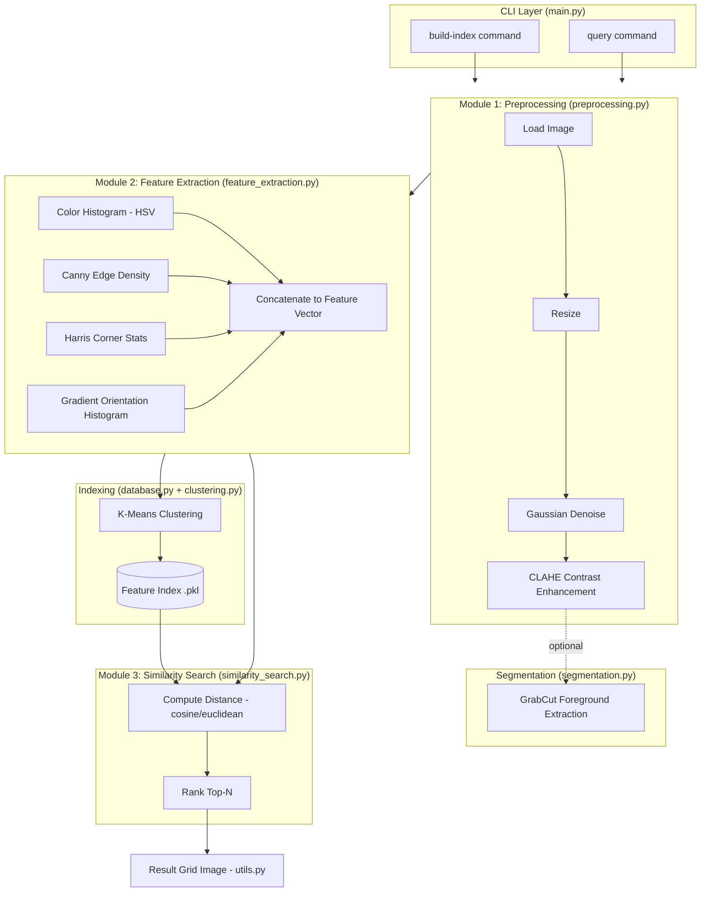

# System Architecture

**Layers:**
- **CLI Layer** — user-facing entry point (`build-index`, `query` subcommands)
- **Module 1 (Preprocessing)** — Unit 1 concepts: convolution-based filtering, histogram-based enhancement
- **Segmentation** — optional GrabCut step (Unit 3: graph-cut segmentation)
- **Module 2 (Feature Extraction)** — Unit 3 concepts: edges, corners, orientation histograms
- **Indexing** — Unit 4 concept: K-Means clustering for faster retrieval
- **Module 3 (Similarity Search)** — distance computation and ranking
- **Output** — visual result grid for inspection
