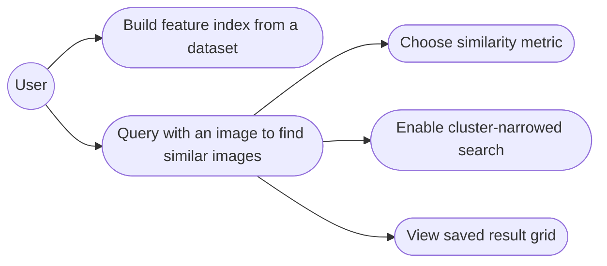
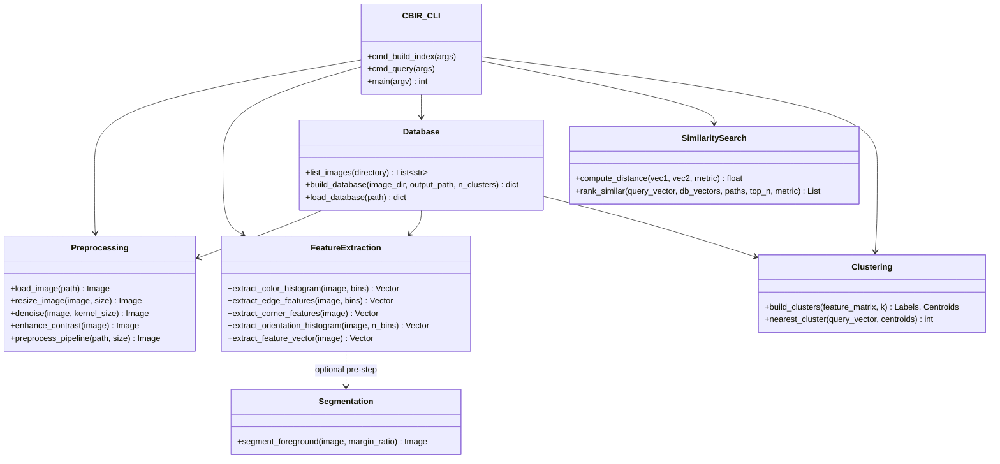
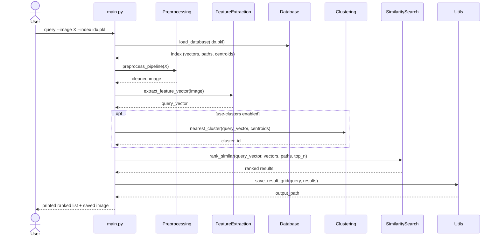

# UML Diagrams

## Use Case Diagram



## Class / Component Diagram



## Sequence Diagram — Query Flow



## Note on ER Diagram

This project does not use a relational database — the feature index is
persisted as a single serialized Python dictionary (`.pkl` file)
containing image paths, feature vectors, and cluster assignments. No
ER diagram applies; see `database.py` for the index schema instead:

```
index = {
    "paths":             List[str]            # image file paths
    "vectors":           np.ndarray (N x D)    # feature vectors
    "cluster_labels":    np.ndarray (N,)       # K-Means cluster id per image
    "cluster_centroids": np.ndarray (K x D)    # cluster centers
}
```
