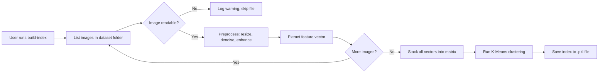
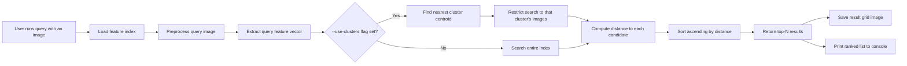

# Process Flow / Workflow

## Workflow 1 — Build Index

```mermaid
flowchart LR
    A[User runs build-index] --> B[List images in dataset folder]
    B --> C{Image readable?}
    C -- No --> D[Log warning, skip file]
    C -- Yes --> E[Preprocess: resize, denoise, enhance]
    E --> F[Extract feature vector]
    F --> G{More images?}
    G -- Yes --> B
    G -- No --> H[Stack all vectors into matrix]
    H --> I[Run K-Means clustering]
    I --> J[Save index to .pkl file]
```

## Workflow 2 — Query

```mermaid
flowchart LR
    A[User runs query with an image] --> B[Load feature index]
    B --> C[Preprocess query image]
    C --> D[Extract query feature vector]
    D --> E{--use-clusters flag set?}
    E -- Yes --> F[Find nearest cluster centroid]
    F --> G[Restrict search to that cluster's images]
    E -- No --> H[Search entire index]
    G --> I[Compute distance to each candidate]
    H --> I
    I --> J[Sort ascending by distance]
    J --> K[Return top-N results]
    K --> L[Save result grid image]
    K --> M[Print ranked list to console]
```
